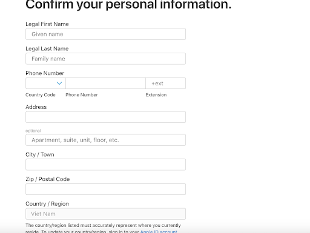

# register_apple_developer

Hướng Dẫn Đăng Ký Tài Khoản Apple Developer Nếu bạn muốn phát triển và phát hành ứng dụng trên App Store, bạn cần đăng ký tài khoản Apple Developer. Dưới đây là hướng dẫn chi tiết về yêu cầu, tài liệu cần chuẩn bị và các bước thực hiện.

## I. Tài liệu tham khảo

Trước khi bắt đầu, hãy tham khảo các tài liệu chính thức của Apple:

Gói đăng ký Apple Developer: https://developer.apple.com/programs/enroll/

Số D-U-N-S (D-U-N-S Number): https://developer.apple.com/support/D-U-N-S/

Nếu bạn đăng ký tài khoản tổ chức (Company / Organization), bạn cần có số D-U-N-S. Nếu chưa có, bạn có thể đăng ký miễn phí tại: 👉 https://developer.apple.com/enroll/duns-lookup/#!/search

(Lưu ý: Thời gian xét duyệt số D-U-N-S mất khoảng 5 - 7 ngày làm việc).

Ở đây có giải thích D-U-N-S là gì và tại sao cần: https://vivabcs.com.vn/tin-tuc/doanh-nghiep-viet-nam/dang-ky-ma-so-d-u-n-s-dinh-danh-danh-nghiep/#:~:text=S%E1%BB%91%20D%2DU%2DN%2DS%20(vi%E1%BA%BFt%20t%E1%BA%AFt%20c%E1%BB%A7a,tin%20v%E1%BB%81%20doanh%20nghi%E1%BB%87p%20%C4%91%C3%B3.

## II. Yêu Cầu Cần Chuẩn Bị
Trước khi bắt đầu quá trình đăng ký, bạn cần chuẩn bị các thông tin và tài liệu sau:

1. Tài khoản Apple cá nhân có xác thực 2 bước

Người đăng ký tài khoản Apple Developer cần có một Apple ID riêng.
Apple ID phải được bật xác thực hai yếu tố (Two-Factor Authentication) và liên kết với một thiết bị Apple như iPhone, iPad, hoặc Mac. Nếu chưa bật xác thực hai yếu tố, hãy thực hiện: Vào Cài đặt (Settings) > Tên của bạn (Your Name) > Mật khẩu & Bảo mật (Password & Security). Bật Two-Factor Authentication và làm theo hướng dẫn.

Đối với đăng ký tài khoản cho tổi chức, cần dùng email tổ chức của google rồi đăng ký account apple, sau đó dùng account đó để đăng ký.

2. Số D-U-N-S (D-U-N-S Number) (Chỉ dành cho tổ chức)

D-U-N-S Number là mã số nhận diện doanh nghiệp.

3. Thẻ thanh toán quốc tế (Visa/MasterCard)

Apple Developer Program có phí duy trì hàng năm :

99 USD/năm cho tài khoản cá nhân hoặc tổ chức. 299 USD/năm cho tài khoản Enterprise.

Bạn cần thẻ tín dụng hoặc thẻ ghi nợ quốc tế (Visa/MasterCard) để thanh toán phí này có một chú ý là khi tạo tài khoản hãy dùng tên thẻ thanh toán đúng với tên tài khoản của bạn để được duyệt một cách dễ dàng hơn nha

Note: Với case của K-Tech là tài khoản Apple Tổ chức 99USD. Hiện tại chưa có dự án nào liên quan tới Enterprise. Có account tổ chức cho dễ quản lý phân quyền.

## III. Các Bước Đăng Ký Tài Khoản Apple Developer

🔹 Bước 1: Truy cập trang đăng ký 

Vào trang https://developer.apple.com/programs/enroll/ chọn Start Your Enrollment

🔹 Bước 2: Đăng nhập Apple ID và xác thực hai bước

Đăng nhập bằng Apple ID (nằm trong tổ chức) của người chịu trách nhiệm tài khoản. Nếu bạn đang đăng nhập trên một thiết bị Apple, sẽ có một popup yêu cầu xác thực hai bước (Two-Factor Authentication). Nhập mã xác thực được gửi đến thiết bị Apple đã đăng ký.

🔹 Bước 3: Điền thông tin cá nhân hoặc tổ chức

Bạn sẽ cần nhập các thông tin sau:

Tên đầy đủ của chủ tài khoản. Địa chỉ email liên kết với Apple ID. Số điện thoại liên hệ. Loại tài khoản (Cá nhân hoặc Tổ chức). 

🔸 Lưu ý:

Nếu chọn Company / Organization, bạn sẽ cần nhập số D-U-N-S. Tên tổ chức phải trùng khớp với thông tin đăng ký D-U-N-S, nếu không đơn đăng ký có thể bị từ chối.

🔹 Bước 4: Chọn loại tài khoản phù hợp

Company / Organizations 

🔹 Bước 5: Điền số D.U.N.S

🔹 Bước 6: Nhập đầy đủ thông tin của doanh nghiệp vào form

🔹 Bước 7: Khi gửi yêu cầu thành công sẽ có kết quả như ảnh dưới Apple sẽ xác minh yêu cầu đăng ký của bạn

🔹 Bước 8: Khi đã xác minh xong apple sẽ gửi email thanh toán về mail đăng ký khi đó bạn sẽ tiến hành thanh toán cho tài khoản( sẽ mất 1 - 2 ngày)

## IV. Kiểm Tra Trạng Thái Đăng Ký
 
Sau khi đăng ký, bạn có thể kiểm tra trạng thái tại:
🔗 https://developer.apple.com/account/
